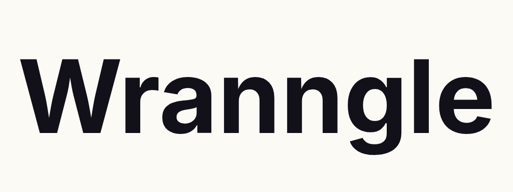
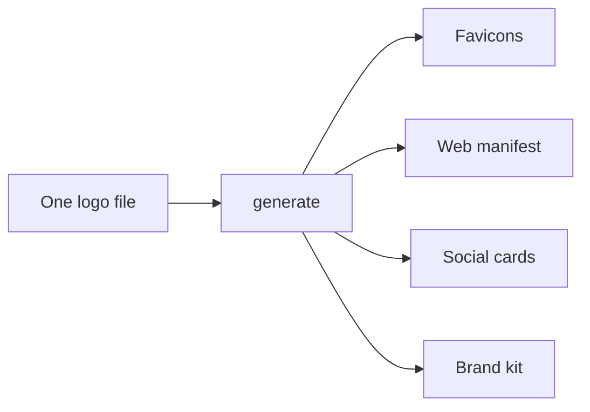
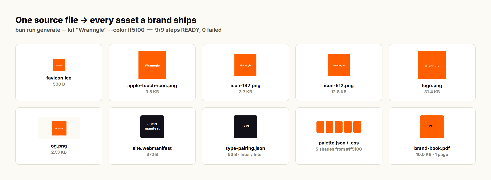

<div align="center">
<picture>
  <source media="(prefers-color-scheme: dark)" srcset="docs/brand/wordmark-dark.png">
  <source media="(prefers-color-scheme: light)" srcset="docs/brand/wordmark-light.png">
  
</picture>

*Self-generated: `bun run generate -- variations "Wranngle" --color ff5f00`*

#### favicons · web manifest · palette extraction · identity kit · logo variations · OG cards

# Brand-asset generator: one logo in, every asset a brand ships out

**[Quick start](#-quick-start) | [Features](#-features) | [What one file becomes](#-what-one-file-becomes) | [Usage](#-usage) | [License](#license)**

**❤️ [Sponsor this project](https://github.com/sponsors/wranngle) ❤️**

[](https://github.com/wranngle/logo_maker/actions/workflows/ci.yml)
[](LICENSE)
[](https://github.com/wranngle/logo_maker/commits/master)
[](https://github.com/wranngle/logo_maker/graphs/contributors)

[](https://github.com/wranngle/logo_maker/stargazers)
[](https://github.com/wranngle)
</div>

---


Every favicon, manifest, and OG image Wranngle ships starts as one PNG or SVG here. You point **logo_maker** at one logo (PNG, SVG, or a data-url text file); it emits favicons, a web manifest, and social preview images. The browser tab icon, the home-screen icon, and the link-preview card all come from the same source, so they never drift apart. Edit the source, rerun, and every derivative updates. The wordmark at the top of this page is its own output.



## ⚡ Features

- 🧿 **Favicons**: `favicon.ico`, `apple-touch-icon.png`, `icon-192.png`, `icon-512.png`, and a vector `icon.svg` when the input is SVG.
- 📱 **Web manifest**: a `site.webmanifest` wired to the generated icons, with `--app-name`, `--short-name`, `--theme-color`, and `--background-color` under your control.
- 🖼️ **Social cards**: `og-image`, `profile`, and `social-feed` renders in PNG and WebP, so the link preview matches the tab icon.
- 🎨 **Palette extraction**: the `palette` subcommand reads the logo and writes `palette.css` and `palette.json`.
- 🧰 **Identity kit**: `kit "Name" --color <hex>` builds a wordmark, raster logo, favicon, manifest, palette, type pairing, OG card, and a brand-book PDF in one run.
- ✒️ **Logo variations**: `variations "Name" --color <hex>` emits wordmark, monogram, icon, dark, and light SVGs from nothing but a name and a hex.

## 🚀 Quick start

Requires [Bun](https://bun.sh).

1. Clone and install

   ```bash
   git clone https://github.com/wranngle/logo_maker && cd logo_maker
   bun install
   ```

2. Generate from the bundled sample logo

   ```bash
   bun run generate -- raw/logo-data-url.txt
   ```

3. Open `output/` and drop the files into your site.

<details>
<summary>Full kit run: a complete identity from one name and one hex</summary>

```bash
bun run generate -- kit "Wranngle" --color ff5f00
```

The run walks wordmark, raster logo, favicon, web manifest, palette, type pairing, OG card, and brand-book PDF, then writes a kit README and a `kit.json` manifest beside them.

</details>

## ✒️ Variations

| Wordmark | Monogram | Icon | Dark | Light |
| :---: | :---: | :---: | :---: | :---: |
|  |  |  |  |  |

*Five variations from one name and one hex.*

## 🧩 What one file becomes



<table>
<tr>
<td align="center" width="33%"><b>Browser tab</b><br/><code>favicon.ico</code></td>
<td align="center" width="33%"><b>Home screen</b><br/><code>apple-touch-icon.png</code>, <code>icon-192.png</code>, <code>icon-512.png</code></td>
<td align="center" width="33%"><b>App install</b><br/><code>site.webmanifest</code>, plus <code>icon.svg</code> for SVG input</td>
</tr>
<tr>
<td align="center" width="33%"><b>Link previews</b><br/><code>og-image.png</code>, <code>og-image.webp</code></td>
<td align="center" width="33%"><b>Social profiles</b><br/><code>profile.png</code>, <code>social-feed.png</code>, <code>social-feed.webp</code></td>
<td align="center" width="33%"><b>Full kit</b><br/><code>palette.json</code>, <code>palette.css</code>, <code>type-pairing.json</code>, <code>brand-book.pdf</code></td>
</tr>
</table>

## 🧰 Usage

Pass a PNG, SVG, or PNG/SVG data URL text file:

```bash
bun run generate -- raw/logo-data-url.txt
```

Flags: `--output <dir>` (default `./output`), `--app-name`, `--short-name`, `--theme-color <hex>`, `--background-color <hex>`, `--help`.

Subcommands:

```bash
bun run generate -- palette raw/logo-data-url.txt        # palette.css + palette.json; --output, --count
bun run generate -- kit "Wranngle" --color ff5f00        # brand kit; --out, --type serif|sans|display|mono, --og minimal|bold|gradient
bun run generate -- variations "Wranngle" --color ff5f00 # wordmark, monogram, icon, dark, light SVGs; --out
```

Lint, typecheck, test:

```bash
bun run check
```

## License

MIT. See [LICENSE](LICENSE).
